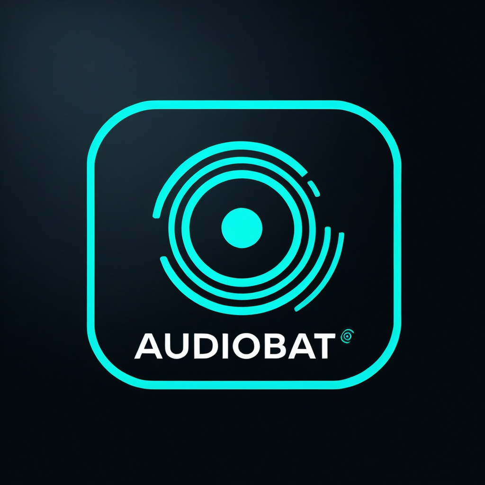

# AudioBat




<br> <br>

<br> <br>

## About


Librería para procesar registros activos de llamadas de ecolocalización de murciélagos en ambientes con interferencia por ruido ultrasónico de origen antrópico. 

> [!NOTE]
> Este es un TP integrador para Ingeniería de Software II.[^1]


## Instalación


Para acceder al servicio web visite: http://localhost:5000/


Descargar el repositorio:
```
docker pull ghcr.io/alejandroescobar264/audiobat:web
```


Correr el repo de github:
```
docker run -d -p 5000:5000 --name audiobat-web ghcr.io/alejandroescobar264/audiobat:web
```


Para instalar los requerimientos emplear el comando:

```
pip install -r requirements.txt
```

> [!WARNING]
> Para hacer andar las importaciones en VS Code se deben instalar los modulos con el comando:
> ``` pip install -e . ```


Para eliminar cache de docker:
```
docker builder prune -a
```

Para construir el contenedor de docker:
```
docker build -t audiobat-web .
```

Para lanzar el contenedor en el puerto 5000
```
docker run -p 5000:5000 audiobat-web
```

## CLI Service


Para subir archivos en el contenedor:
```
curl -X POST -F "audio_file=@/home/alejandro/Documentos/github_repos/AudioBat/Audio/Grabaciones/AR1/AR1ecAR1303712_20240918_012907.wav"  http://localhost:5000/upload_audio
```

Para descargar los resultados:
```
curl -X GET http://localhost:5000/download_results/AR1ecAR1303712_20240918_012907.wav --output /home/alejandro/Descargas/AR1ecAR1303712_20240918_012907.zip


```

## Requerimientos


Para abordar este trabajo vamos a centrarnos en los requerimientos funcionales clave:

1. **Procesamiento de Archivos de Audio y Preprocesamiento**:
    - El sistema debe permitir la carga y procesamiento de archivos de audio en formato ".wav".
    - El sistema debe realizar preprocesamiento para eliminar ruido ultrasónico de origen abiótico.
    - El sistema debe poder mostrar una gráfica del archivo de audio en el tiempo.
    - El usuario debe poder seleccionar un determinado rango de tiempo en el que realizar los análisis
  
2. **Generación de Espectrogramas y Visualización**:
    - El sistema debe generar espectrogramas a partir de los archivos de audio procesados.
    - El sistema debe permitir guardar los espectrogramas en formatos de imagen estándar (PNG, JPEG).

3. **Identificación Automática de Especies**:
    - El sistema debe identificar automáticamente las especies de murciélagos presentes en los archivos de audio a partir de los patrones acústicos.
    - El sistema debe mostrar métricas clave por especie (frecuencia máxima, mínima, etc.).

4. **Generación de Reportes**:
    - El sistema debe generar reportes automáticos con los resultados del análisis de audio, identificando especies de murciélagos y tipos de llamadas.
    - Los reportes deben estar disponibles en formatos utilizables (PDF, CSV).

5. **Acceso a través de red local**
    - El modulo debe de poder usado como un servicio de la red local.
    - Debe poder enviarse un archivo y poder descargar los resultados.
    - Se debe implementar para desplegarse en un server.


[^1]: Facultad de Ingeniería de la Universidad Nacional de Entre Ríos (FIUNER).
